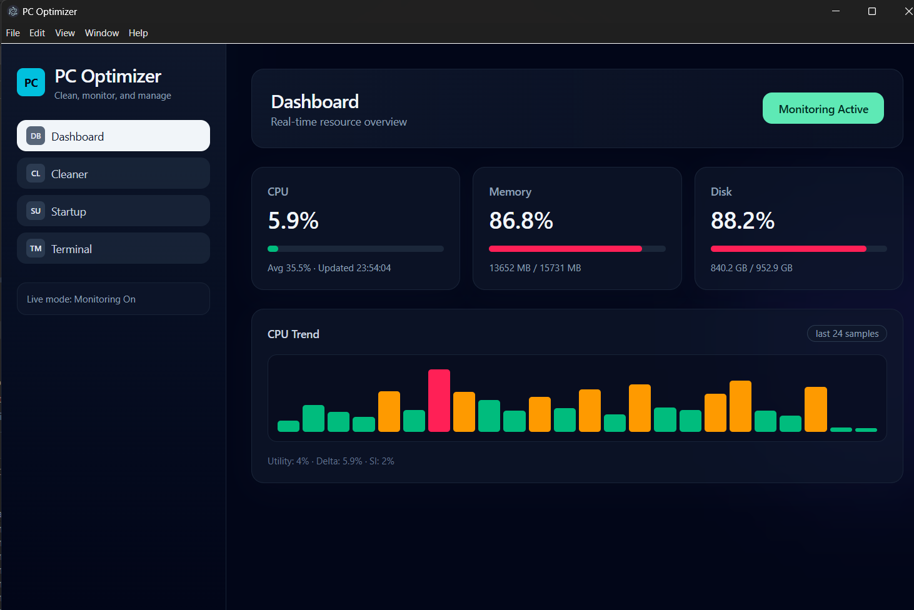
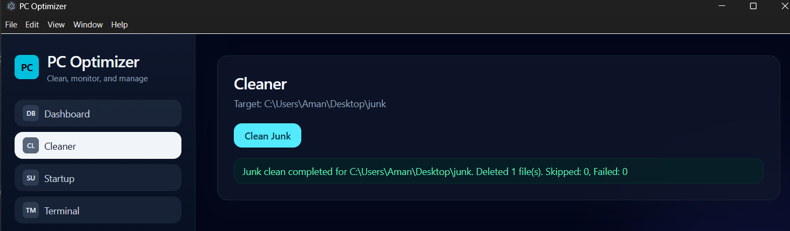
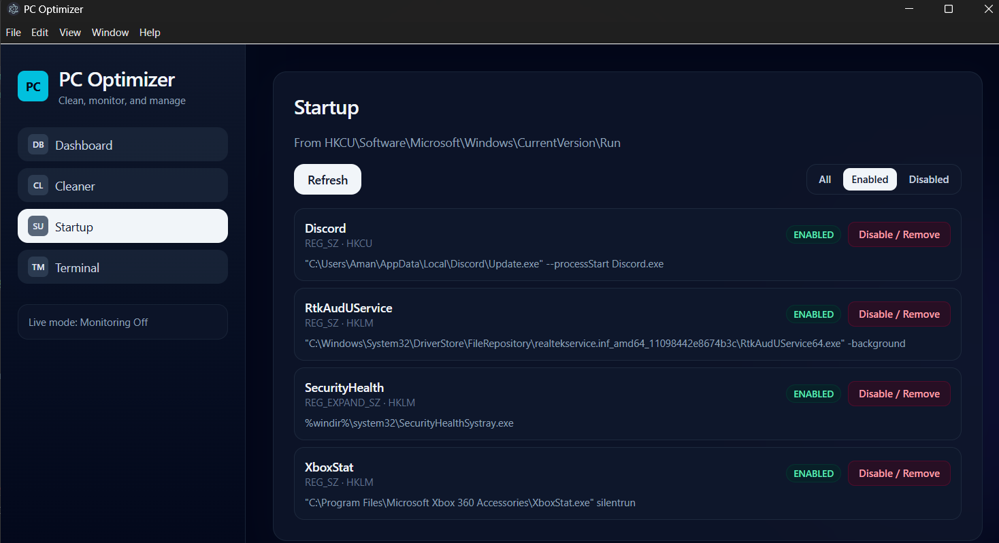
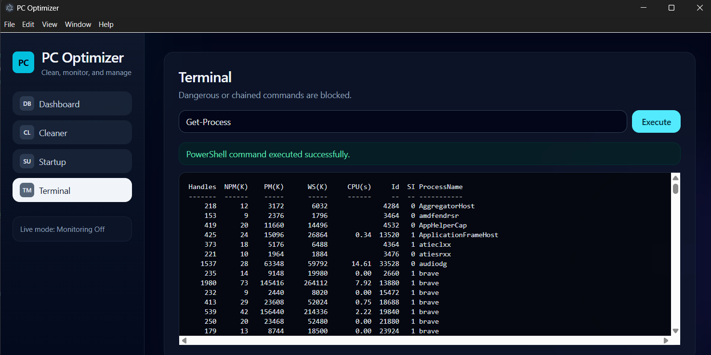

# PC Optimizer

Windows desktop utility built with Electron, React, TypeScript, and Tailwind CSS.

It combines real-time system monitoring with practical optimization tools in a clean dashboard UI.

## Overview

PC Optimizer is a modular Electron app with secure IPC and context isolation.

Current modules:

- Dashboard: CPU, RAM, Disk monitoring with live refresh and trend chart
- Cleaner: Safe junk cleanup for a scoped folder
- Startup Apps: Registry-based startup manager (HKCU + HKLM Run)
- Terminal: Sandboxed PowerShell execution with basic command validation

## Tech Stack

- Electron 41
- React 19 + TypeScript 6
- Vite 8
- Tailwind CSS 4
- systeminformation
- winreg (typed with @types/winreg)

## Feature List

### Core

- Secure contextBridge API from preload to renderer
- IPC request/response handlers for all core tools
- Tailwind-powered modern dashboard with sidebar navigation

### Monitoring

- Real-time CPU/RAM/Disk stats
- 1-second refresh loop with non-blocking async collection
- CPU trend mini chart for recent samples



### Cleaner

- Cleanup scoped to a fixed directory
- Safe file filtering and deletion guards
- Confirmation flow + success/error summaries



### Startup Apps Manager

- Reads startup entries from:
  - HKCU\\Software\\Microsoft\\Windows\\CurrentVersion\\Run
  - HKLM\\Software\\Microsoft\\Windows\\CurrentVersion\\Run
- Applies enabled/disabled status from StartupApproved metadata
- Filter chips: All / Enabled / Disabled
- Disable/remove action per actionable Run entry



### Terminal Runner

- PowerShell command execution via main process IPC
- Basic dangerous command validation
- Live output panel with success/error state



## Run Locally

### Prerequisites

- Node.js 18+
- npm

### Install

```bash
npm install
```

### Development

```bash
npm run dev
```

### Production Build

```bash
npm run build
```

### Launch Built App

```bash
npm start
```

## Scripts

| Command | Description |
|---|---|
| npm run dev | Full dev mode (main + preload watch + renderer dev server) |
| npm run build | Build preload, main, and renderer |
| npm start | Launch built Electron app |
| npm run type-check | Run TypeScript checks |


## Future Improvements

- Startup parity with Task Manager:
  - Add Startup folder scanning (user + common)
  - Show publisher and startup impact metrics
- Cleaner enhancements:
  - Preview mode (dry run) before deletion
  - User-configurable cleanup targets
- Terminal hardening:
  - Command allowlist profiles
  - Audit log for executed commands
- Productization:
  - Installer packaging and code signing
  - Auto-update pipeline
  - In-app settings and telemetry controls

## Security Notes

- Renderer is isolated from Node APIs
- Main-process handlers gate privileged operations
- Startup and cleaner actions include validation and confirmation


